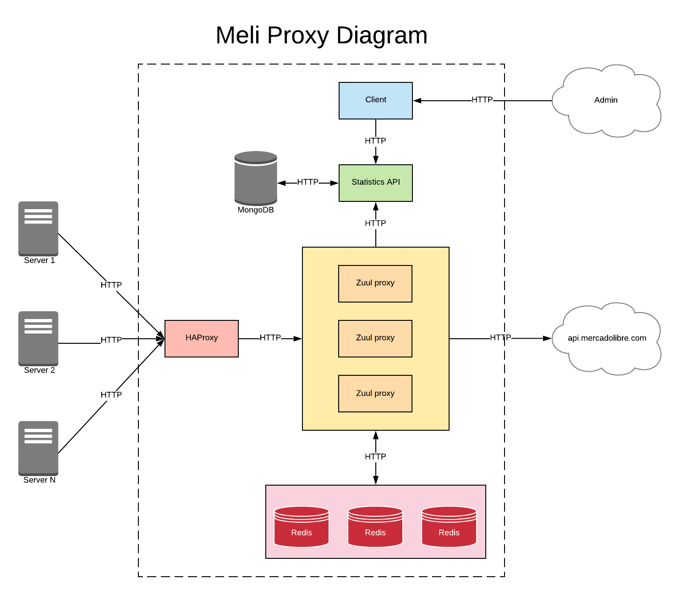

# Meli Proxy

API Proxy developed for the Mercado Libre technical challenge.

## Getting Started

These instructions will get you a copy of the project up and running on your local machine for development and testing purposes.

### Prerequisites

https://www.docker.com/get-started

### Usage

Run in the command line:
```
docker-compose up
```

Test the proxy:
```
curl http://localhost:8080/categories/MLA5725
```

Open statistics dashboard at http://localhost:4200

## Solution diagram



## Built With

* [Spring Boot](https://spring.io/) - The backend framework used
* [Maven](https://maven.apache.org/) - Dependency Management
* [Angular](https://angular.io/) - The frontend framework used
* [Zuul](https://github.com/Netflix/zuul) - Gateway service

## Author

* **Brian Froschauer**
